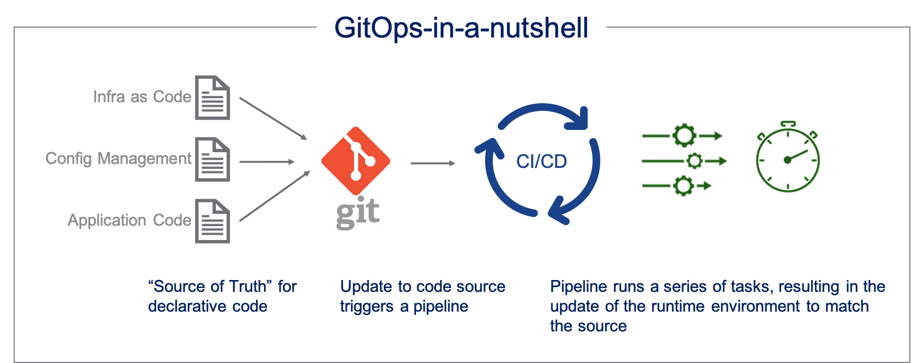
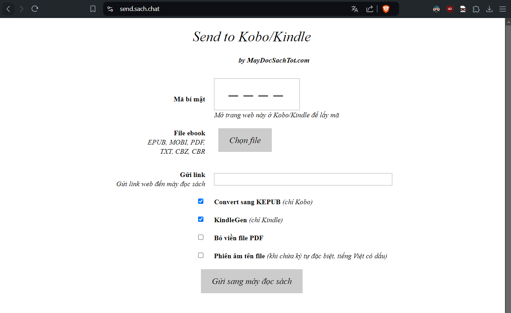
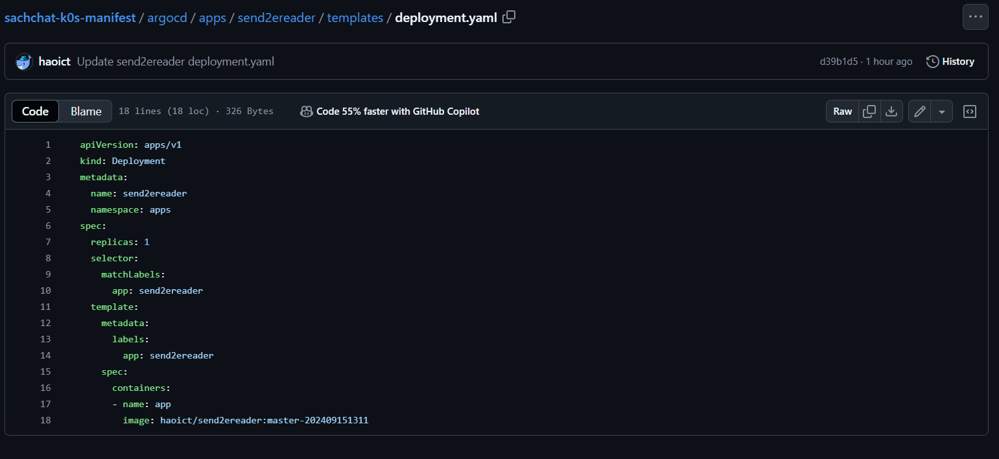
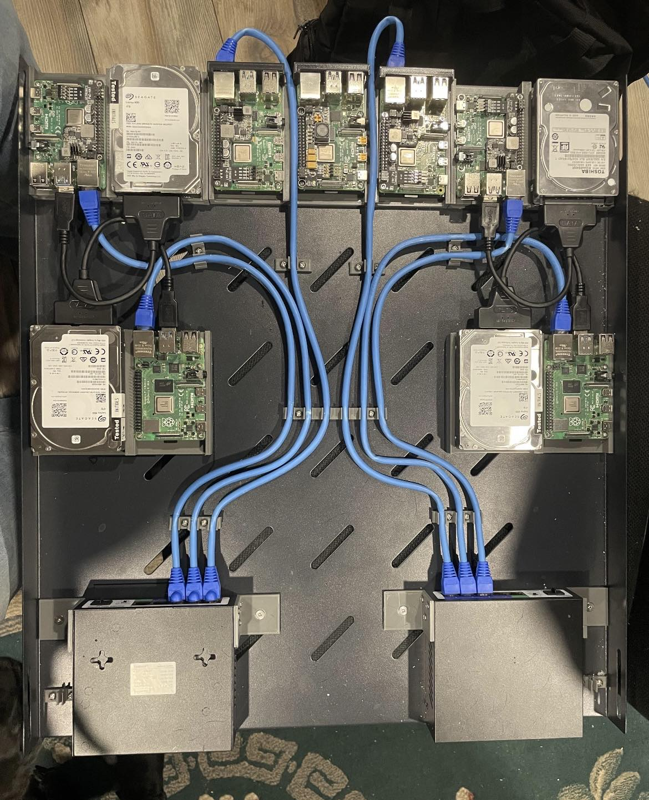
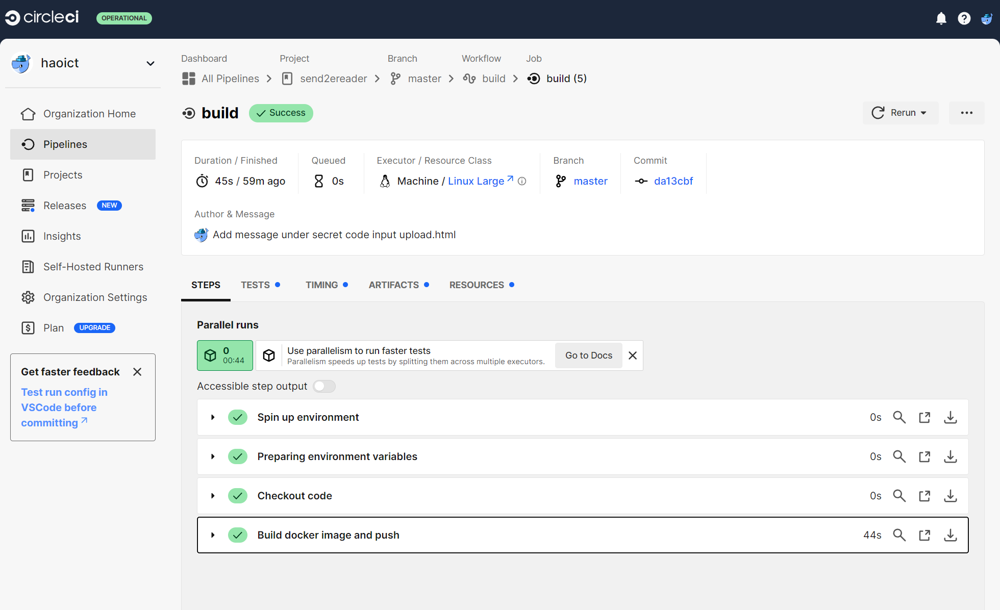
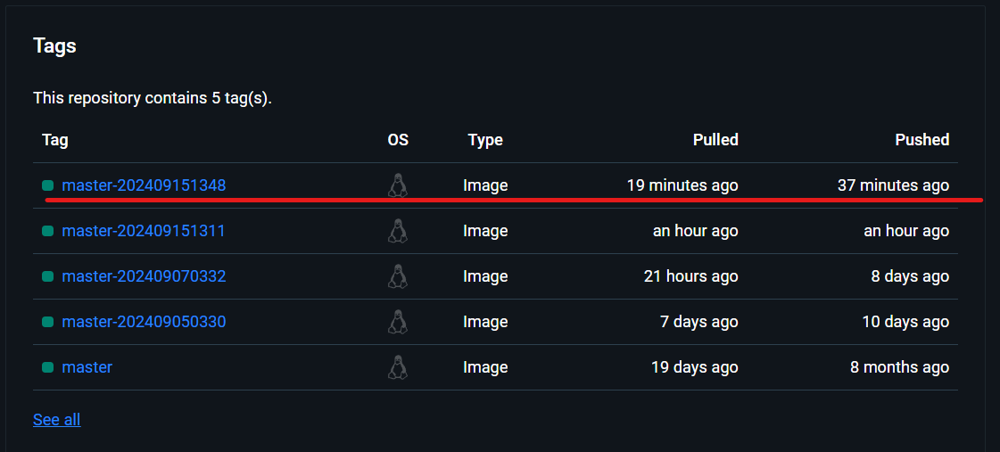
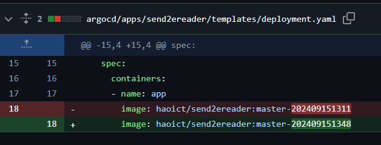
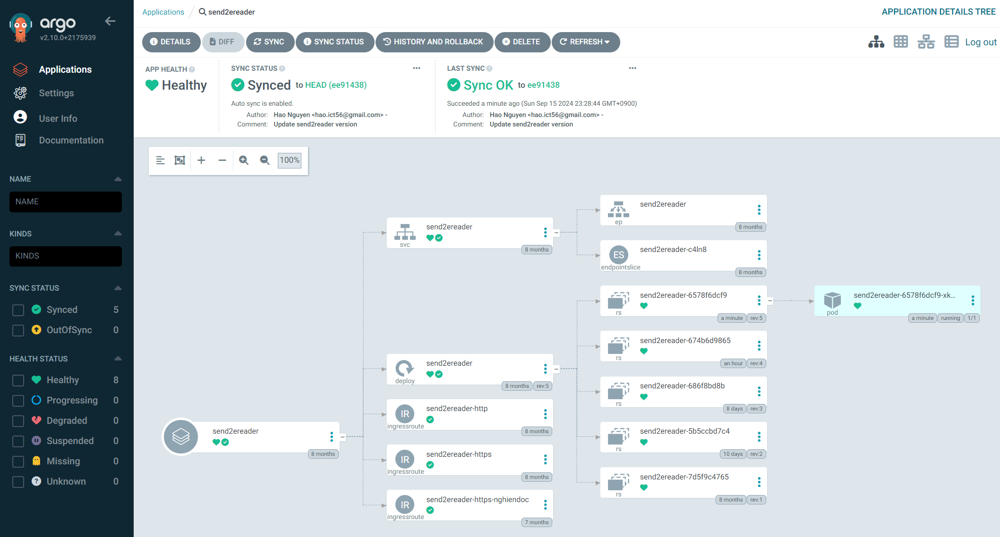
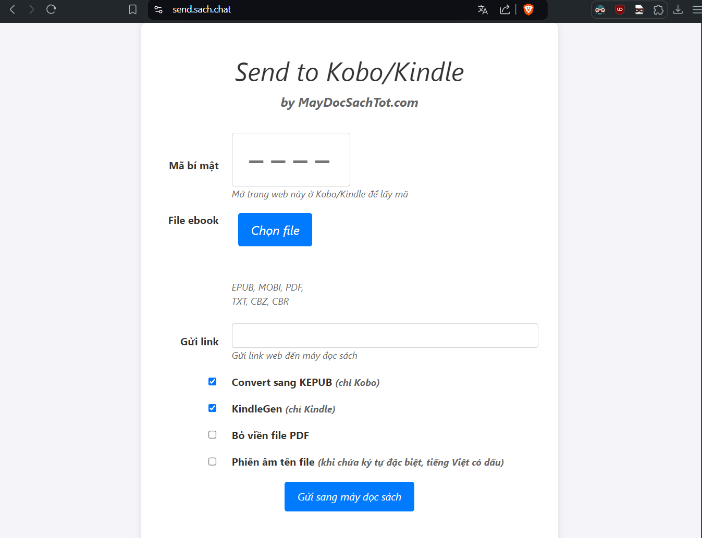

# Git Ops Development

## Introduction

GitOps is a modern approach to continuous delivery and operational management that uses Git as the single source of truth for declarative infrastructure and applications. It automates deployment processes, ensuring consistency, reliability, and transparency.

### Key Concepts of GitOps

1. Declarative Infrastructure: Define infrastructure and application states using configuration files.
2. Version Control: Store and track configuration files in Git repositories.
3. Automated Deployment: Use CI/CD pipelines to apply changes from Git to the environment.
4. Observability and Monitoring: Monitor and ensure the deployed state matches the desired state.

### Benefits of GitOps

- Consistency and Reliability: By using Git as the single source of truth, GitOps ensures that the deployed state is consistent with the desired state, reducing configuration drift and human errors.
- Auditability and Compliance: All changes are tracked in Git, providing a clear audit trail and facilitating compliance with regulatory requirements.
- Faster Recovery: In case of failures, teams can quickly revert to a previous known good state by rolling back changes in the Git repository.
- Improved Collaboration: GitOps promotes collaboration among team members by leveraging familiar Git workflows and pull requests for code reviews and approvals.

### Implementing GitOps

1. Set Up a Git Repository: Create a Git repository to store your declarative configuration files for infrastructure and applications.
2. Define Desired State: Write configuration files that define the desired state of your infrastructure and applications using tools like Kubernetes manifests, Helm charts, or Terraform scripts.
3. Configure CI/CD Pipelines: Set up CI/CD pipelines to automatically apply changes from the Git repository to the target environment. Tools like Argo CD, Flux, or Jenkins can be used for this purpose.
4. Monitor and Alert: Implement monitoring and alerting mechanisms to ensure the deployed state matches the desired state. Tools like Prometheus, Grafana, and Alertmanager can be used for observability.

## My simple example

### Setup Git repository
I have a very simple website, it helps sending ebooks to eReaders (Kobo/Kindle) from PC or phones.

The website: [https://send.nghiendoc.com](https://send.nghiendoc.com)

You can find the source code of this website at: [https://github.com/haoict/send2ereader](https://github.com/haoict/send2ereader)

### Setup CI

First thing first, containerize your application, here's the Dockerfile
[https://github.com/haoict/send2ereader/blob/master/Dockerfile](https://github.com/haoict/send2ereader/blob/master/Dockerfile)

I use CircleCI to build docker image of the website whenever there's a push commit to the master branch. To setup CircleCI, there's a lot of tutorial on the internet. Here's my circleci's config:
[https://github.com/haoict/send2ereader/blob/master/.circleci/config.yml](https://github.com/haoict/send2ereader/blob/master/Dockerfile)

### Setup CD

To deploy the application, I use Helm and Kubernetes, sorry but the helm chart repository is not open source, but here's how it looks like:

My K8s cluster, (kind of, LOLOLOLOL):

I use ArgoCD - a Kubernetes-native continuous deployment (CD) tool. Unlike external CD tools that only enable push-based deployments, Argo CD can pull updated code from Git repositories and deploy it directly to Kubernetes resources.

### Connecting things together

I want to add css to this website to make it look fancier. So I'm gonna make a new commit and push

After pushed, CircleCI should build a new docker image when you push a new commit:

Argo is the most important part of this GitOps development, after CircleCI finished building the app's docker image, I can get the image's tag and update it in the helm deployment.yaml

After pushing the helm deployment.yaml update. Argo will automatically detect the change and deploy it

Now the website has a fresh look

## Conclusion

GitOps is a powerful approach to managing infrastructure and application deployments, offering numerous benefits in terms of consistency, reliability, and collaboration. By leveraging Git as the single source of truth and automating deployment processes, teams can achieve greater efficiency and agility in their operations. Implementing GitOps requires careful planning and adherence to best practices, but the rewards are well worth the effort.

Embrace GitOps to streamline your development and operational workflows, and take your DevOps practices to the next level.