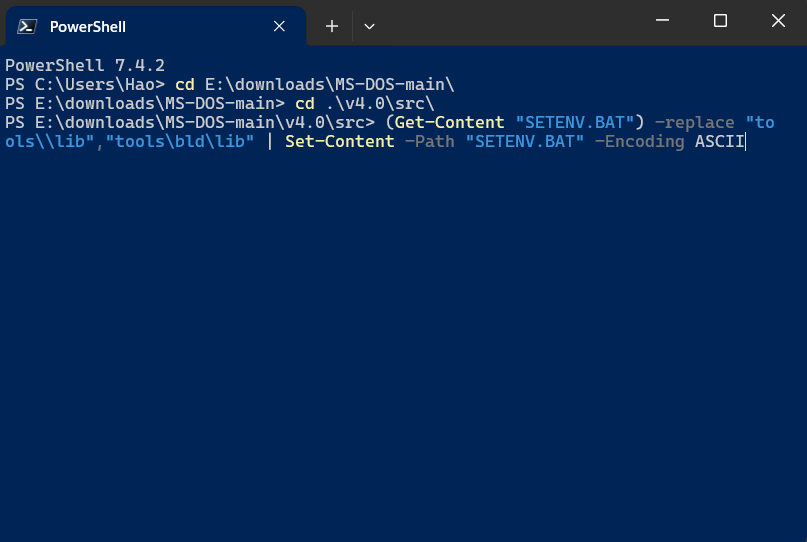

# How to compile the MS-DOS from Microsoft open source

## Overview

Recently Microsoft just opened source MS-DOS 4.0 under MIT license. Let's try to compile it.  

MS-DOS github: [https://github.com/microsoft/MS-DOS](https://github.com/microsoft/MS-DOS)

More info: [https://cloudblogs.microsoft.com/opensource/2024/04/25/open-sourcing-ms-dos-4-0/](https://cloudblogs.microsoft.com/opensource/2024/04/25/open-sourcing-ms-dos-4-0/)

## Prepare

### Compiling Environment

Since the toolchain shipped with the source code in the same repository are 16 bit binaries. We can't run it in modern Windows 10 or 11. We need to run it under a 16 bit Virtual machine or emulator. It can be FreeDOS (VM) or DOSBox (emulator). We'll use DOSBox because it's easy to setup and run directly in Windows 10/11.

Download and setup DOSBox: [https://www.dosbox.com/download.php?main=1](https://www.dosbox.com/download.php?main=1)


!!! info "You can press Ctrl+F12 to increase CPU speed, around 18000-20000 cycles is a good number"

### Obtain the source code

Download the source code from MS-DOS Github repo: [https://github.com/microsoft/MS-DOS/archive/refs/heads/main.zip](https://github.com/microsoft/MS-DOS/archive/refs/heads/main.zip)  
and then extract it

or clone it with git clone command
```bash
git clone --depth=1 https://github.com/microsoft/MS-DOS.git
```


### Mount the source code directory to DOSBox

In order to use files from the host computer (Windows 10/11) in DOSBox, we have to mount it.  
In DOSBox Run this command:
```bash
# mount source code to driver D
mount d c:\Users\Hao\Download\MS-DOS-main\v4.0

# go to the source code dir
D:
cd SRC

# verify
DIR
```

The command will mount the directory `C:\Users\Hao\Download\MS-DOS-main\v4.0` (host computer) to driver `D:` of DOSBox.  
Remember to change `C:\Users\Hao\Download\MS-DOS-main\v4.0` with your path in your computer


## Compiling

### First try

From here, we can try to compile it. Run:
```bash
RUNME.BAT
```
it will print the guide how to build it. You can open `RUNME.BAT` from the host computer to see the whole file content


Basically there're 3 steps:

* Run `SETENV.BAT` to setup environment
* Run `NMAKE` command to start building
* Run `CPY outputDir` to copy the built files to the output folder

Let's try it

```bash
SETENV.BAT

NNAME
```


There are errors due to file encoding (need to change to ASCII) and line ending differences between linux and DOS (need to change from LF to CRLF), we have to patch it. You can try to do it yourself or use my script to do it quickly.  

### Patch the source code

Open PowerShell from host computer, `cd` to the `MS-DOS-main\v4.0\src` directory and run these commands one by one
```bash
(Get-Content "SETENV.BAT") -replace "tools\\lib","tools\bld\lib" | Set-Content -Path "SETENV.BAT" -Encoding ASCII
(Get-Content "SETENV.BAT") -replace "tools\\inc","tools\bld\inc" | Set-Content -Path "SETENV.BAT" -Encoding ASCII

(Get-Content "MAPPER/GETMSG.ASM") -replace "\xEF\xBF\xBD|\xC4\xBF|\xC4\xB4","#" | Set-Content -Path "MAPPER/GETMSG.ASM" -Encoding ASCII
(Get-Content "SELECT/SELECT2.ASM") -replace "\xEF\xBF\xBD|\xC4\xBF|\xC4\xB4","#" | Set-Content -Path "SELECT/SELECT2.ASM" -Encoding ASCII
(Get-Content "SELECT/USA.INF") -replace "\xEF\xBF\xBD|\xC4\xBF|\xC4\xB4","#" | Set-Content -Path "SELECT/USA.INF" -Encoding ASCII

Get-ChildItem -Path . -Filter *.BAT -Recurse -File | ForEach-Object {
    echo $_.FullName
    (Get-Content -raw $_.FullName) -replace "(?<!`r)`n","`r`n" | Set-Content -nonewline -Encoding ASCII $_.FullName
}
Get-ChildItem -Path . -Filter *.ASM -Recurse -File | ForEach-Object {
    echo $_.FullName
    (Get-Content -raw $_.FullName) -replace "(?<!`r)`n","`r`n" | Set-Content -nonewline -Encoding ASCII $_.FullName
}
Get-ChildItem -Path . -Filter *.SKL -Recurse -File | ForEach-Object {
    echo $_.FullName
    (Get-Content -raw $_.FullName) -replace "(?<!`r)`n","`r`n" | Set-Content -nonewline -Encoding ASCII $_.FullName
}
Get-ChildItem -Path . -Filter ZERO.DAT -Recurse -File | ForEach-Object {
    echo $_.FullName
    (Get-Content -raw $_.FullName) -replace "(?<!`r)`n","`r`n" | Set-Content -nonewline -Encoding ASCII $_.FullName
}
Get-ChildItem -Path . -Filter LOCSCR -Recurse -File | ForEach-Object {
    echo $_.FullName
    (Get-Content -raw $_.FullName) -replace "(?<!`r)`n","`r`n" | Set-Content -nonewline -Encoding ASCII $_.FullName
}
```




Now let's build again
```bash
cd D:\SRC
SETENV.BAT
NMAKE
```

Tada!!! The build is successful. 🎉🎉


## Runing the compiled MS-DOS 4.0

Now we can copy built files to the output directory. Run:
```bash
# make output dir
mkdir D:\BIN

CPY D:\BIN
```


Now we're inside the built directory of the DOS 4.0, we can run the new built `COMMAND.COM` shell

```bash
cd D:\BIN

# set DOSBox version to 4
ver set 4

# check version
ver
# -> you can see printed version is 4.00 from DOSBox
# "DOSBox version 0.74-3. Reported DOS version 4.00."

# now call COMMAND.COM from D:\BIN directory to swith shell

COMMAND.COM

# check version, again
ver
# ->now  you can see printed version is 4.00 from the new shell
# "MS-DOS Version 4.00"
```

That's it, now we're running MS-DOS 4.00 from the binaries we just built.  
Congratulations!!


## What's next?

From here, you can try to build a bootable image and boot it with Virtual Box or VMWare. Goodluck!  
